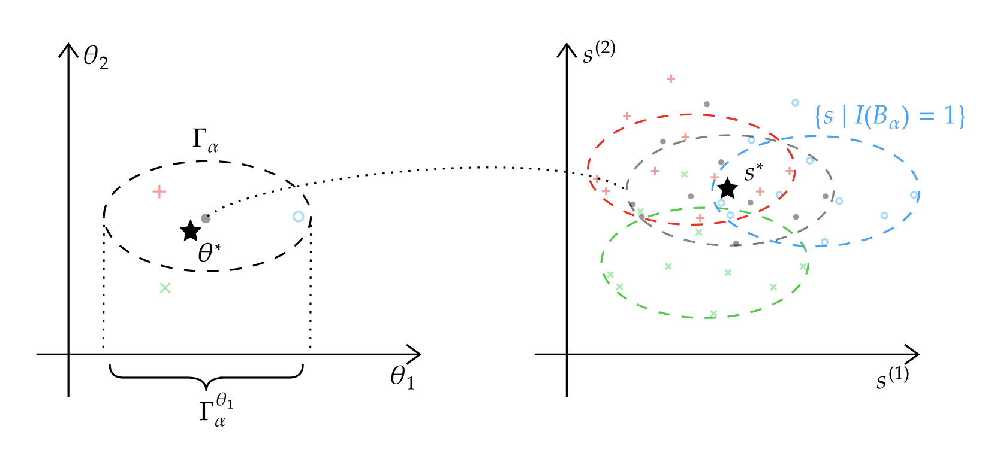

```{r, include = FALSE}
knitr::opts_chunk$set(
  collapse = TRUE,
  comment = "#>"
)
```

## Introduction

In the era of data-driven decision-making, access to detailed
individual-level data has become critical both for research and
industrial use. Accompanying this demand for personal data is the need
for protecting personal privacy. Differential privacy (DP) has emerged
as the gold standard for privacy protection, enabling the release of
aggregated information while mathematically guaranteeing a quantifiable
level of privacy at the individual level.

Despite their benefits, DP mechanisms usually complicate the sampling
distribution and introduce biases, making it hard to conduct statistical
inferences. The `SimBaRepro` package addresses this challenge by
leveraging the *repro samples* framework---a simulation-based approach
to statistical inference. Unlike asymptotic methods, `SimBaRepro`
constructs confidence sets and hypothesis tests that are valid for
finite samples while accounting for the known DP mechanism. Key
functions include:

-   `p_value()`: Hypothesis testing for privatized data.\
-   `get_CI()`: Finite-sample confidence intervals.\
-   `confidence_grid()`: Multivariate confidence regions.\
-   `grid_projection()`: 2D confidence regions.
-   `plot_grid()`: Visualization of 2D confidence regions.

This package is based on the work of @Awan25.

## General Framework

One of the central problems in statistical inference is the difficulty
of correctly accounting for the uncertainties introduced in the
data‐generating process. The “repro sample” framework provides a
finite‐sample, simulation‐based approach that does not rely on
asymptotic approximations (e.g. the CLT) or on a closed‐form likelihood.
The key observation is that, while the marginal distribution of the data
can be complex or even intractable, the data‐generating mechanism itself
is often known and easy to simulate. This procedure produces valid
confidence intervals and p-values.

### Data generating equation and the seed

We assume that the observed summary statistic\
$$s \,\mathbin{\overset{d}{=}}\, G(\theta^*,u),$$ arises from a known,
deterministic mapping\
$$G:\;\Theta\times\mathscr{U}\longrightarrow\mathscr{S},$$ together with
a “seed”\
$$u \sim P,$$ whose distribution $P$ does not depend on the the
parameter $\theta^*$. Intuitively, $u$ captures all of the randomness in
the data generation process (sampling noise, privacy noise, etc.), while
$G$ describes how that randomness is transformed by the parameter
$\theta^*$ into the observed summary statistic $s$.

For example, if $X_1,...,X_R$ are sampled from $N(\mu^*,\sigma^{*2})$
and $s=(X_1,...,X_R)$, we can take $$G(\theta^*, u)=\mu^*+\sigma^*u$$
where $\theta^*=(\mu^*,\sigma^{*2})$ and $u\sim N(0,I_R)$. This works
for more complicated cases, such as when DP mechanisms are used. Let
$X_1,...,X_R$ be i.i.d. samples from $N(\mu^*,\sigma^{*2})$, and are
clamped before adding an additional Laplace noise to obtain
$\tilde{X}_1,...,\tilde{X}_R$. Let $\theta^*=(\mu^*,\sigma^{*2})$ be the
true parameter, and let $u=(u_\text{data}, u_\text{DP})$ be the noise
consisting of the data generating noise and DP mechanism noise. If we
define:

$$
\text{clamp}[x]_a^b=\max\{a,\min\{b,x\}\},
$$

then the generating equation for $(\tilde{X}_1,...,\tilde{X}_R)$ looks
like
$$G(\theta^*,u)=\text{clamp}\left[\mu^*+\sigma^*u_\text{data}\right]_a^b+u_\text{DP},$$
where the data noise $u_\text{data}$ is sampled from $N(0,I_R)$ and the
privacy noise $u_\text{DP}$ is sampled from
Laplace$\left(0,\frac{b-a}{\epsilon}\right)$ .

### Repro samples

In order to learn about a parameter $\theta$, we draw $R$ i.i.d. "repro
seeds" $u_1,...,u_R\sim P$ and compute $$s_i(\theta)=G(\theta,u_i).$$

At the true parameter $\theta^*$, $s_i(\theta^*)$ are i.i.d. with the
same distribution as the observed $s$. We then compare the observed $s$
to this "cluster" of simulated $\{s_i(\theta)\}_{i=1}^R$, with the
intuition that close-to-true parameter should generate clusters that are
"close" to $s$.

```{r, echo=FALSE, results='asis'}
cat('
<style>
.figure .caption {
  text-align: left !important;
}
</style>
')
```

```{r, fig.cap="This figure shows the mapping from a parameter to a collection of repro samples via the generating function. In this case, the blue and red parameters generate repro samples that are 'close' (lies in the prediction set $B_\\alpha$) to the observed statistic, so they are included in the confidence set. On the other hand, the green parameter generates repro samples that are not 'close enough' to the observed statistic, hence it's not included in the confidence set $\\Gamma_\\alpha$. For additional details on the prediction set $B_\\alpha$ and confidence set $\\Gamma_\\alpha$, please refer to the paper. (Taken from Figure 1 in @Awan25.)", out.width="100%", echo=FALSE}


```

### Exchangeable statistic $T$

But how exactly are we going to measure the "distance" between the
observed $s$ and a cluster of artificial data $\{s_i(\theta)\}_{i=1}^R$?
@Awan25 makes use of an exchangeable function
$T_\theta:\mathscr{S}\times\mathscr{S}^{R+1}\to[0,1]$, meaning that the
function output is the same regardless of the order of the $R+1$
statistics. The first input to the function is the statistic whose
"distance" to the collection of $R+1$ statistics we want to measure. The
$R+1$ statistics consist of the observed statistic $s$ and the $R$
generated statistics $\{s_i(\theta)\}_{i=1}^R$. The function output
should have the property that smaller outputs imply *less* similarity
between the first argument and the point cloud in the second argument.
In the package, this exchangeable statistic is defaulted to the
Mahalanobis distance. However, the user also has the freedom to define
different $T$'s, as long as they satisfy the conditions specified above.

### p-values and confidence sets

Fixing $R$ repro seeds $u_1,...,u_R\sim^\text{i.i.d.}P$, and let
$s_1(\theta),...,s_R(\theta)$ denote the statistics generated with the
generating equation with parameter $\theta$ and the seeds. Let $s$ be
the observed statistic, we define
$$T_\text{obs}(\theta)=T_\theta(s;s, s_1(\theta), ..., s_R(\theta))$$
and
$$T_{(i)}(\theta)=T_\theta(s_i(\theta);s, s_1(\theta), ..., s_R(\theta))$$
for $i=1,...,R$. In the case when $\theta=\theta^*$ (statistics are
generated with the true parameter), the rank of $T_\text{obs}(\theta)$
among all $R+1$ statistics are uniformly distributed on
$\{1,2,...,R+1\}$ by symmetry. However, if the $R$ statistics are
generated with a parameter far from the ground truth, then
$T_\text{obs}$ are expected to be ranked lower compared to the other
$\{T_{(i)}(\theta)\}_{i=1}^R$. Based on this, we can design a hypothesis
test of the form
$$H_0:\theta\in\Theta_0\text{ v.s. }H_1:\theta\notin \Theta_0.$$ In this
test, the p-value can be defined as:
$$p:=\sup_{\theta\in\Theta_0}\frac{1}{R+1}\Big(|\{T_{(i)}(\theta)\le T_\text{obs}(\theta)\}|+1\Big).$$
Furthermore, a $(1-\alpha)$-confidence set can be defined as the region
$$\left\{\theta:\frac{1}{R+1}\Big(|\{T_{(i)}(\theta)\le T_\text{obs}(\theta)\}|+1\Big)\ge\alpha\right\}.$$
Given the seeds, generating equation, and a test statistic, this package
automatically computes the p-values and confidence sets using numerical
methods.

## Main Functions

### `p_value`

This function computes a p-value that can be used towards hypothesis
tests of the form:
$$H_0:\theta\in \Theta_0\text{ v.s. }H_1:\theta\not\in\Theta_0.$$ It
identifies the parameter value (within a specified search space) that
makes the observed statistic most "plausible" under simulated data.

#### **Inputs**

-   **`lower_bds`, `upper_bds`**: Vectors defining the parameter search
    bounds which describe $\Theta_0$.

-   **`seeds`**: An array of random seeds used to generate fake
    statistics. Even though there's no strict requirements for the shape
    of `seeds` in principle, it's recommended to have $R$ rows where $R$
    refers to the number of *repro* samples. The number of columns
    depends on the actual distribution and the privacy mechanism (if
    there is one).

-   **`generating_fun`**: A function of `seeds` and some parameter
    $\theta\in\Theta$. This function should be designed according to how
    the `seeds` is defined. For a general rule of thumb, this function
    should take each row of the seeds and produce one fake statistic
    (could be multi-dimensional). The function should return an array,
    where each row represents a fake statistic.

-   **`s_obs`**: A vector encoding the observed statistic.

-   **`theta_init`**: An optional vecotr argument which specifies the
    starting parameter $\theta\in\Theta$ for the search. If not
    specified, the midpoint `(lower_bds + upper_bds)/2` is used.

-   **`T_stat`**: An optional function argument which takes an array
    `x`, an array `data` of $R+1$ rows, and `theta` as inputs. Some
    permutation-invariant "depth"
    $T_\theta:\mathbb{R}^d\times\mathbb{R}^{(R+1)\times d}\to[0,1]$ is
    computed for each row of `x` and the entire array `data`. The
    returned object is a numeric vector consisting of numbers in between
    $0$ and $1$, where lower values correspond to "unusual" statistics.
    If not specified, this defaults to using the Mahalanobis distance.

-   **`print_info`**: An optional Boolean argument default to `FALSE`.
    If `TRUE`, the function will print out the optim messages at each
    searching step. This is useful when debugging.

-   **`check_input`**: An optional Boolean argument default to `TRUE`.
    Automatically checks the input data types.

#### **Returns**

The `p_value` function returns a list of two objects: `p_val` and
`theta_hat`. `theta_hat` will be the parameter (the most likely
parameter given the observed statistic in the specified parameter set)
corresponding to the largest p-value---`p_val`. In a hypothesis test of
significance level $\alpha$, if `p_val` is less than $\alpha$, then the
null hypothesis should be rejected. On the contrary, if `p_val` is
greater or equal to $\alpha$, then at least one paramter in the null
hypothesis is valid.

### `get_CI`

This function computes a confidence interval given the specified
significance level using a bisection search method.

#### **Inputs** (only ones that have not been mentioned before)

-   **`alpha`**: A numeric input specifying the significance level for
    the confidence interval.

-   **`parameter_index`**: An index indicating the parameter the
    confidence interval is for. For example, if the parameter $\theta$
    is defined as the vector $c(\text{mean},\text{variance})$, then
    setting `parameter_index` equal to $2$ means that we're finding a
    confidence interval for the variance.

-   **`tol`**: This input specifies the numerical tolerance allowed when
    computing the confidence interval. The returned confidence interval
    contains the true confidence interval, with width of the interval
    bounded above by the width of the true confidence interval plus
    `tol`. A smaller tolerance means more precise confidence intervals,
    but requires more computation power (increases logarithmically
    w.r.t. `tol`).

#### **Returns**

The `get_CI` function returns a vector of length $2$, specifying two
sides of the confidence interval.

### `confidence_grid`

Using the `p_value` function as a subroutine, this function computes a
multi-dimensional indicator array representing the confidence region,
where a "$1$" indicates inclusion in the confidence set, and "$0$"
otherwise.

#### **Inputs**

-   **`resolution`**: An integer specifying the number of partitions for
    each parameter. Setting `resolution` equal to $5$ means that each
    dimension is evenly partitioned into $5$ sections, forming a total
    of $5^d$ cubed regions ($d$ is the number of dimensions of the
    parameter space).

#### **Returns**

The `confidence_grid` function returns a list containing the indicator
array (`ind_array`), and two vectors `search_lower_bds` and
`search_upper_bds` representing the simultaneous confidence intervals
for all parameters. The returned lower bounds and upper bounds are not
to be confused with the input lower bounds and upper bounds which
specify the entire search region.

### `grid_projection`

While `confidence_grid` generates an indicatory array, it may not be
straightforward to visualize when there are more than two parameters.
`grid_projection` projects an indicator array of any dimension down to
$2$-dimensional arrays based on the specified dimensions, so that the
result can be visualized using the `plot_grid` function.

#### **Inputs**

-   **`indicator_array`**: The indicator array generated using the
    `confidence_grid` function.

-   **`index_set`**: A vector of length $2$ specifying which two
    dimensions to project the indicator array. For example, if the
    parameter is three-dimensional, setting this input to be $c(1,3)$
    means that the returned array will be the indicator array for the
    first and third dimensions.

#### **Returns**

This function returns a 2-dimensional indicator array.

### `plot_grid`

#### **Inputs**

-   **`indicator_array`**: A 2-dimensional indicator array, either
    generated by `confidence_grid` or by `grid_projection`.

-   **`lower_bds`, `upper_bds`**: Length-2 vectors that specify the
    lower bounds and upper bounds of the plot region. Note that if the
    indicator array is produced using the `grid_projection` function,
    the user must choose the lower bounds and upper bounds for the two
    parameters of interests only.

## Example Workflows

In this section, we'll walk through a few simple examples to demonstrate
the some regular workflow using this package.

### Regular Normal

To begin, we consider a simple example where the data is drawn i.i.d.
from a normal distribution with unknown mean $\mu$ and unknown variance
$\sigma^2$: $$X_i\sim N(\mu, \sigma^2).$$ Suppose the observed
statistics (sample mean and variance) are disclosed, how do we obtain
confidence intervals (or sets) of the true population parameters? First,
let's load the pacakge:

```{r setup}
library(SimBaRepro)
```

Specify the sample size, significance level, and a large enough Repro
sample size (usually $200$ is enough).

```{r}
n <- 50 # sample size
repro_size <- 200 # number of repro samples
```

Generate a matrix of seeds that will be used to generate 'fake'
statistics, which has `repro_size` rows. The number of columns depends
on the specific problem. In this case, it has `n` columns, one for each
of the i.i.d. data points.

```{r}
seeds <- matrix(rnorm(repro_size * n), nrow = repro_size, ncol = n)
```

We'll also write a function that, given some parameter and the random
seeds defined previously, computes 'repro_size' copies of the 'fake'
statistics and stack them vertically. In this case, the first component
of 'theta' represents the mean, and the second component represents the
variance.

```{r}
s_sample <- function(seeds, theta) {
  # generate the raw data points
  data <- theta[1] + sqrt(theta[2]) * seeds[, 1:n]
  
  # compute the regular statistics
  s_mean <- apply(data, 1, mean)
  s_var <- apply(data, 1, var)
  
  return(cbind(s_mean, s_var))
}
```

Suppose the observed statistic is as follows:

```{r}
s_obs <- c(1.12, 0.67)
```

#### Regular Normal: The 'p_value' function

With the above observed statistic, we want to conduct a hypothesis test
for whether the true mean is $0$:

$$H_0:\mu=0, H_1:\mu\ne 0.$$

What's the p-value of the test with the observed statistics given above?
The 'p_value' function in the package comes in handy here. Set both
'lower_bds' and 'upper_bds' to equal to $(0, 1e-6)$and $(0,10)$
respectively (choose a large enough range for the variance), and use the
seeds, generating function, and observed statistic from before:

```{r}
lower_bds = c(0, 1e-6)
upper_bds = c(0, 10)
result <- p_value(lower_bds, upper_bds, seeds, s_sample, s_obs)
print(result$p_val) # p_value
```

If the significance level of the test is $0.05$, then we reject the null
hypothesis that the population mean is $0$. Alternatively, we can
conduct composite hypothesis tests:

$$
H_0:\theta\in \Theta_0, H_1:\theta\notin\Theta_0,
$$

where $\Theta_0$ is of the form $[l_1,u_1]\times[l_2,u_2]\times\cdots$.
In this case, the 'p_value' function searches through the whole
parameter space $\Theta_0$ and finds the parameter corresponding to the
largest p-value. For example, if $\Theta_0=[-1,2]\times[1,5]$, then we
can do the following:

```{r}
lower_bds = c(-1, 1) # lower bounds for mean and variance
upper_bds = c(2, 5) # upper bounds for mean and variance
result <- p_value(lower_bds, upper_bds, seeds, s_sample, s_obs)
print(result$p_val) # the largest p_value found
print(result$theta_hat) # the parameter corresponding to the largest p value
```

If the significance level is $0.05$, then we fail to reject the null
hypothesis.

#### Regular Normal: The 'get_CI' function

To go a step further, we can find the confidence intervals for the true
mean or variance using the 'get_CI' function. The extra things to
specify here are `parameter_index` (indicating which parameter to get
the confidence interval), significance level `alpha`, and the tolerance
for the confidence intervals `tol` . The returned confidence interval
will cover the actual $(1-\alpha)$-confidence interval with at most a
difference of 'tol' in width. First, let's find the confidence interval
for the mean (which is the first argument in `s_obs`).

```{r}
lower_bds <- c(-5, 1e-6)
upper_bds <- c(5, 10)
parameter_index <- 1 # an integer specifying the parameter of interest
alpha <- .05 # significance level
tol <- 1e-3 # tolerance
# choosing j=1 indicates that we're obtaining a confidence interval for the first argument in s_obs. In this case, it's the mean.
mean_CI <- get_CI(alpha, lower_bds, upper_bds, parameter_index, seeds, s_sample, s_obs, tol)
print(mean_CI)
```

Similarly, we can get a confidence interval for the variance:

```{r}
parameter_index <- 2
var_CI <- get_CI(alpha, lower_bds, upper_bds, parameter_index, seeds, s_sample, s_obs, tol)
print(var_CI)
```

The methodology adopted here ensures that the obtained confidence
interval will contain the actual confidence interval, with its width
bounded by the width of the actual confidence interval plus `tol`.

#### Regular Normal: The 'confidence_grid' function

In many situations, the confidence interval for a single parameter is
very loose and not helpful, especially when the number of parameters is
large. The 'confidence_grid' function in this package obtains a
confidence set . `resolution` is an extra input needed here that
specifies the number of grids for each element of the parameter. Since
we already have a sense of where the confidence region is from the
previously obtained confidence intervals, we can set `lower_bds` and
`upper_bds` to be much narrower to obtain a finer representation of the
confidence region.

```{r}
lower_bds <- c(0.5, 1e-6)
upper_bds <- c(1.5, 1.5)
resolution <- 13
result <- confidence_grid(alpha, lower_bds, upper_bds, seeds, s_sample, s_obs, tol, resolution)
indicator_array <- result$ind_array
print(result)
```

We can also retrieve the simultaneous confidence intervals for both
parameters as follows:

```{r}
print(c(result$search_lower_bds[1], result$search_upper_bds[1]))
print(c(result$search_lower_bds[2], result$search_upper_bds[2]))
```

#### Regular Normal: The 'plot_grid' function

This package includes a function called 'plot_grid' which takes the
indicator array above and visualizes it. Note that the 'lower_bds' and
'upper_bds' here must agree with the ones used to produce this indicator
array.

```{r}
plot_grid(indicator_array, lower_bds, upper_bds)
```

Note that the plot looks just like a rotated version of the indicator
array above, this is because coordinates start from the top left of the
array but bottom left of the plot.

#### The 'grid_projection' function

Usually, parameter spaces are not just 2-dimensional, but
higher-dimensional as well. In these cases, the indicator array produced
by the 'confidence_grid' function is also higher-dimensional array. The
indicator array is useful on its own, but if we want to visualize it, we
must project it down to 2 dimensions via the 'gird_projection' function.
Take, for instance, a joint Gaussian model with $\mu_1=0,\mu_2=1$, and
identity covariance matrix $\Sigma=\sigma^2 I_2$ (uncorrelated joint
Gaussian with a common variance $\sigma^2=1$.). First, we obtain the
indicator array as usual:

```{r, include=FALSE}
n <- 100            # sample size
repro_size <- 200   # number of repro samples
seeds <- matrix(rnorm(repro_size * (2 * n)), nrow = repro_size, ncol = 2 * n)

s_sample <- function(seeds, theta) {
  n_obs <- ncol(seeds) / 2   
  mu1 <- theta[1]           
  mu2 <- theta[2]          
  sigma <- sqrt(theta[3])
  
  seeds1 <- seeds[, 1:n_obs, drop = FALSE]        # first n columns for X
  seeds2 <- seeds[, (n_obs + 1):(2 * n_obs), drop = FALSE]  # next n columns for Y
  
  # Generate bivariate data
  data1 <- mu1 + sigma * seeds1   # X ~ N(mu_1, sigma^2)
  data2 <- mu2 + sigma * seeds2   # Y ~ N(\mu_2, sigma^2)
  
  # Compute statistics
  s_mean1 <- rowMeans(data1)      # sample mean of X
  s_mean2 <- rowMeans(data2)      # sample mean of Y
  s_var1 <- apply(data1, 1, var)  # sample variance of X (denominator n-1)
  s_var2 <- apply(data2, 1, var)  # sample variance of Y (denominator n-1)
  
  return(cbind(s_mean1, s_mean2, s_var1, s_var2))
}

s_obs <- c(-0.1, 0.1, 1.05, 0.9)
alpha <- 0.05
tol <- 1e-3

lower_bds <- c(-0.5, -0.5, 1e-6)
upper_bds <- c(0.5, 0.5, 2)
resolution <- 10
result <- confidence_grid(alpha, lower_bds, upper_bds, seeds, s_sample, s_obs, tol, resolution)
indicator_array <- result$ind_array
print(result)
```

Now, suppose we're interested in the confidence set involving only the
two means $\mu_1, \mu_2$, then we can choose the index set as follows:

```{r}
index_set <- c(1,2)
means_array <- grid_projection(indicator_array, index_set)
print(means_array)
```

To plot the joint confidence region for $\mu_1,\mu_2$, we then use the
same lower bounds and upper bounds used in the 'confidence_grid'
function, and take only the components corresponding to these two
parameters. For example,

```{r}
means_lower_bds <- lower_bds[index_set]
means_upper_bds <- upper_bds[index_set]
plot_grid(means_array, means_lower_bds, means_upper_bds)
```

Alternatively, if we want to plot the confidence regions for $\mu_1$ and
$\sigma^2$, or for $\mu_2$ and $\sigma^2$, we can choose a different
index set and repeat the above procedure

```{r, include=FALSE}
index_set2 <- c(1,3)
mu1_var_array <- grid_projection(indicator_array, index_set2)
print(mu1_var_array)

index_set3 <- c(2,3)
mu2_var_array <- grid_projection(indicator_array, index_set3)
print(mu2_var_array)
```

```{r, fig.show='hold'}
mu1_var_lower_bds <- lower_bds[index_set2]
mu1_var_upper_bds <- upper_bds[index_set2]
plot_grid(mu1_var_array, mu1_var_lower_bds, mu1_var_upper_bds)

mu2_var_lower_bds <- lower_bds[index_set3]
mu2_var_upper_bds <- upper_bds[index_set3]
plot_grid(mu2_var_array, mu2_var_lower_bds, mu2_var_upper_bds)
```

Although these 2D visualizations are useful , it's to be noted that the
projections by themselves are not enough to reconstruct the original
confidence set. Consider, for example, a cube that's hollow inside.

### DP Normal

Next, we'll consider a setting in which this package was initially
designed for, and where it shines--statistical analysis with
differential privacy. With privacy mechanisms present, it's extremely
hard to analyze the statistics and give closed-form expressions for
confidence intervals/sets. Consider a basic setting where the data is
drawn i.i.d. from a normal distribution with unknown mean $\mu$ and
variance $\sigma^2$. $$X_i\sim N(\mu,\sigma^2)$$To protect the privacy
of the data owners, the data center first clamps the data with lower and
upper bounds $\textit{lower_clamp}$ and $\textit{upper_clamp}$ (publicly
known), then computes an $(\epsilon, 0)$-differentially private
statistic $s_{DP}=(\text{private mean}, \text{private variance})$ before
releasing it to the public. How do we conduct hypothesis tests with
privacy constraints in place? How can we obtain confidence
intervals/sets for the population mean and variance? First, we set the
basic parameters as before:

```{r}
n <- 50 # sample size
repro_size <- 200 # number of repro samples
```

Since the privacy mechanism is also published by the data center, the
clamps and the privacy guarantee parameter $\epsilon$ are publicly
known. Note that these may differ depending on the specific privacy
mechanism.

```{r}
upper_clamp <- 3
lower_clamp <- -3
eps <- 4 # privacy guarantee parameter
```

Now, instead of only the randomness in the data generation process, we
also need randomness associated with the privacy mechanism. Therefore,
we need a matrix of seeds that contains both. Below, `regular_seeds` is
used to generate Gaussian samples, while each column of `dp_seeds` is
used to generate privacy noises for sample mean and sample variance,
respectively. Since we're using the Laplace mechanism here, we choose
the privacy seeds to be a product of shifted Bernoulli$(1/2)$ random
variables and Exp$(1)$ random variables (which have the same
distribution as Laplace$(1)$ random variables).

```{r}
regular_seeds <- matrix(rnorm(repro_size * n), nrow = repro_size, ncol = n)
dp_seeds <- matrix((2 * rbinom(n = repro_size * 2, size = 1, prob = 1/2) - 1) * rexp(repro_size * 2), nrow = repro_size, ncol = 2)
seeds <- cbind(regular_seeds, dp_seeds)
```

Knowing the privacy mechanism, we can define the generating function
that produces i.i.d. samples of the statistics:

```{r}
s_sample <- function(seeds, theta) {
  # generate the i.i.d. normal r.v.s using the first n columns of the seeds
  raw_data <- theta[1] + sqrt(theta[2]) * seeds[, 1:n]

  # clamp the raw data using the clamps defined above
  clamped <- pmin(pmax(raw_data, lower_clamp), upper_clamp)

  # compute the private statistics (adding a properly scaled Laplace noise to the sample mean and sample variance)
  s_mean <- apply(clamped, 1, mean) + (upper_clamp - lower_clamp) / (n * eps / 2) * seeds[, n+1]
  s_var <- apply(clamped, 1, var) + (upper_clamp - lower_clamp)^2 / (n * eps / 2) * seeds[, n+2]

  return(cbind(s_mean, s_var))
}
```

We're now ready to run hypothesis tests and identify confidence
intervals/sets using the provided functions from the package.

#### DP Normal: The 'p_value' function

We begin by encoding the released statistic (private sample mean and
private sample variance) as a vector:

```{r}
s_DP <- c(1.12, 1.07) # define the observed statistic as a vector
```

Let's say we want to test whether or not the mean is in between $0$ and
$1$:

$$
H_0:\mu\in[0,1], H_1:\mu\notin[0,1].
$$

Then we choose a large enough search interval for the other parameters.
In this case, the population variance $\sigma^2$ is assumed to be in the
range $[10^{-6},10]$.

```{r}
lower_bds <- c(0, 1e-6)
upper_bds <- c(1, 10)
```

Again, we apply the `p_value` function for hypothesis tests:

```{r}
result <- p_value(lower_bds, upper_bds, seeds, s_sample, s_DP)
print(result$p_val) # the largest p_value found
print(result$theta_hat) # the parameter corresponding to the largest p value
```

With a significance level of $0.05$, we fail to reject the null
hypothesis.

#### DP Normal: The 'get_CI' function

Now, let's find the confidence intervals for $\mu$ and $\sigma^2$.

```{r}
# search lower bounds and upper bounds for mean and variance
alpha <- .05 # significance level
tol <- 1e-3 # tolerance
lower_bds <- c(-5, 1e-6)
upper_bds <- c(5, 10)
```

First, let's find a $95\%$ confidence interval for $\mu$:

```{r}
# choose parameter_index=1 indicates that we're obtaining a confidence interval for the first argument in s_DP. In this case, it's the mean.
parameter_index <- 1
mean_CI <- get_CI(alpha, lower_bds, upper_bds, parameter_index, seeds, s_sample, s_DP, tol)
print(mean_CI)
```

Similarly, we can obtain a $95\%$ confidence interval for $\sigma^2$, by
changing `parameter_index` from $1$ to $2$:

```{r}
parameter_index <- 2
var_CI <- get_CI(alpha, lower_bds, upper_bds, parameter_index, seeds, s_sample, s_DP, tol)
print(var_CI)
```

#### DP Normal: The 'confidence_grid' function

We can obtain a joint confidence region for $\mu$ and $\sigma^2$. Based
on the individual confidence intervals obtained above, we can choose a
tighter search region to make the visualization look better.

```{r}
lower_bds <- c(0, 1e-6)
upper_bds <- c(2, 5)

resolution <- 20
result <- confidence_grid(alpha, lower_bds, upper_bds, seeds, s_sample, s_DP, tol, resolution)
indicator_array <- result$ind_array
print(result)
```

#### DP Normal: The 'plot_grid' function

Lastly, we can visualize the confidence region using the `plot_grid`
function.

```{r}
plot_grid(indicator_array, lower_bds, upper_bds)
```

The differentially-private confidence region looks more dispersed
compared to the regular normal case, due to the added privacy noise.

# References
